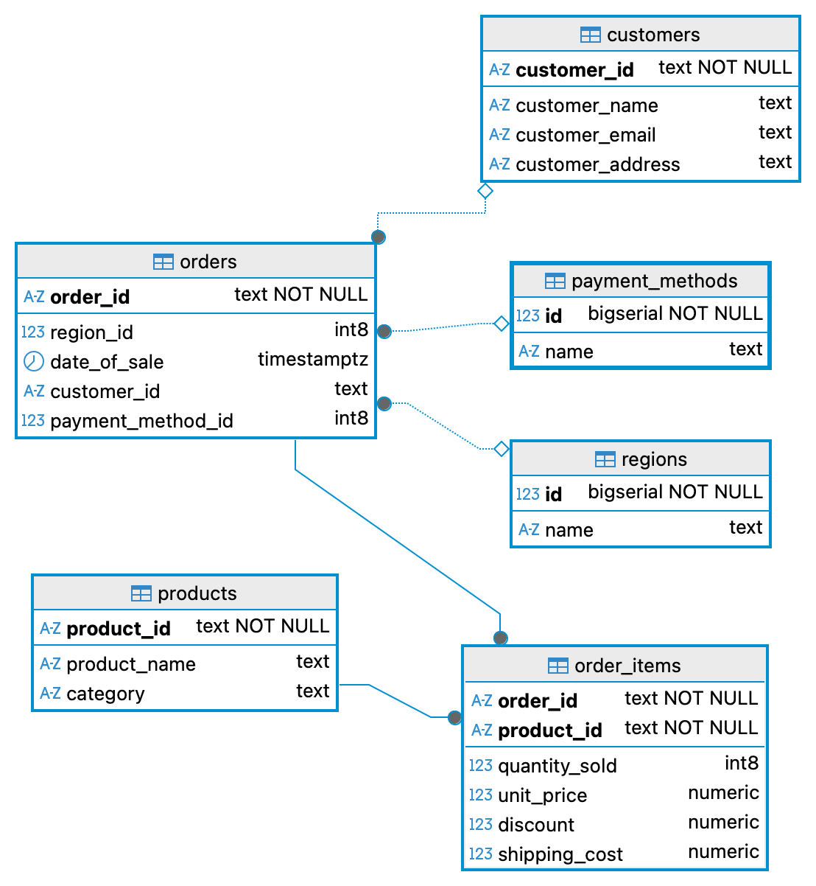

# Sales API

This project provides a RESTful API built with Go, GORM, PostgreSQL, and Zap Logger to manage and analyze sales data imported from CSV files. The system includes features like background data refresh, logging, and analytical endpoints.

---

## Features

- Import sales data from CSV
- Periodic or on-demand data refresh using REST API
- Normalized tables and store data in PostgreSQL
- REST API to analyze top-selling products
- Zap logger integration
- Middleware for request logging
- Duplicate-safe inserts using GORM

---

## Prerequisites

- Go 1.24
- PostgreSQL 13+
- CSV file with the following headers:

```csv
Order ID,Product ID,Customer ID,Product Name,Category,Region,Date of Sale,Quantity Sold,Unit Price,Discount,Shipping Cost,Payment Method,Customer Name,Customer Email,Customer Address
```
---

## Create database
```
CREATE DATABASE salesdb;
```
---

## Environment Variables
```
export IMPORTER_CSV_PATH="sales.csv"
export IMPORTER_INTERVAL_SECONDS=300
export DB_HOST=localhost
export DB_USER=db
export DB_PASSWORD=123
export DB_NAME=salesdb
export DB_PORT=5432
```
---

## How to build and run the project
- Checkout the project from https://github.com/jeroldleslie/salesapi
- Change the directory to the project folder
- Run the below comment to build and run the application 

  ```bash
  make build-run
  ```
  Note: the table will be automatically created while running the application.
---
## REST API Documentation

| Endpoint                     | Method | Description                                                                      | Query Parameters                                                                                   | Sample Response                                                                                                             |
|------------------------------|--------|----------------------------------------------------------------------------------|----------------------------------------------------------------------------------------------------|-----------------------------------------------------------------------------------------------------------------------------|
| `/api/sales/top-products`    | GET    | Get top-selling products based on quantity sold within a date range.             | `from` (required), `to` (required), `region` (optional), `category` (optional), `limit` (optional) | `[{"product_id":"P789", "product_name":"Levi's 501 Jeans", "category":"Clothing", "region":"Asia", "total_sold":3}, {...}]` |
| `/api/sales/refresh-data`    | POST   | Triggers manual CSV data import into the database.                               | None                                                                                               | `HTTP 202 ACCEPTED`                                                                                                         |

---

## ER Diagram


---

## Future Improvements
- Add unit tests for core functionalities (data refresh logic, top-products analytics, etc.)
- Support CSV uploads via API for dynamic import
- Enhance analytics endpoints with filters (e.g., payment method, discount applied)
- Add JWT-based authentication to secure endpoints
- Integrate with CI/CD pipeline for automated testing and linting
- Optional: Add caching (e.g., Redis) for repeated top product queries
